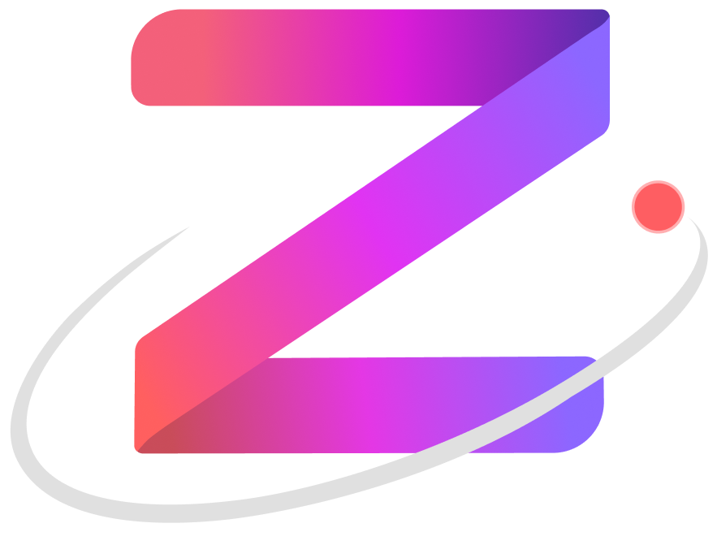

<div align="center">
  

  <h1 style="margin-top: 0px">Zeta SDK 🔌</h1>

  <p>
    <a href="https://discord.gg/dD7YREfBkR"
      ></a>
    <a href="https://opensource.org/licenses/Apache-2.0"
      ></a>
  </p>
</div>

## Zeta SDK

This is the typescript library to interact with our Zeta program smart contract.

[Learn more about Zeta.](https://docs.zeta.markets/)

[Try out Zeta devnet.](https://devnet.zeta.markets/)

## Devnet variables

| Key         |                     Value                     |
| ----------- | :-------------------------------------------: |
| NETWORK_URL |         https://api.devnet.solana.com         |
| PROGRAM_ID  | BG3oRikW8d16YjUEmX3ZxHm9SiJzrGtMhsSR8aCw1Cd7  |
| SERVER_URL  | https://dex-devnet-webserver-ecs.zeta.markets |

## Mainnet variables

| Key         |                    Value                    |
| ----------- | :-----------------------------------------: |
| NETWORK_URL |     https://api.mainnet-beta.solana.com     |
| PROGRAM_ID  | ZETAxsqBRek56DhiGXrn75yj2NHU3aYUnxvHXpkf3aD |

PROGRAM_ID is subject to change based on redeployments.

## Context

Zeta is a protocol that allows the trading of undercollateralized perpetual futures on Solana, using an orderbook matching system. Zeta is available with SOL, BTC, ETH, APT and ARB as underlying assets, with more to come!

Native numbers are represented with BN to the precision of 6 d.p as u64 integers in the smart contract code.

They will need to be divided by 10^6 to get the decimal value.

Use our helper functions in `src/utils.ts` to convert.

```ts
// Asset that we wish to trade on
let asset = constants.Asset.BTC;

// A variable of type BN (big number)
let balance: BN = client.account.balance;

// If you had deposited $10,000 USDC
balance.toNumber(); // == 10_000_000_000

// Convert decimal number to native fixed point.
utils.convertDecimalToNativeInteger(10_000); // == 10_000_000_000;

// Convert native integer to decimal.
utils.convertNativeIntegerToDecimal(balance.toNumber()); // == 10_000

// Convert native BN to decimal.
utils.convertNativeBNToDecimal(balance); // == 10_000
```

## Install

```sh
npm install @zetamarkets/sdk
```

## Getting started

### Setting up a wallet

Before we start writing any code, we need a fresh Solana wallet - skip this if you already have your own wallet.

```sh
# Generate new keypair at ./bot-key.json
solana-keygen new -o bot-key.json

# View new pubkey address
solana-keygen pubkey bot-key.json

# Put private key into .env file used by script
# (Make sure you are in the same directory as where you are running the script.)
echo private_key=`cat bot-key.json` >> .env
```

### .env file

At this point there will be .env file with your freshly created private key. Open it up with your favourite text editor and add the following two lines:

```sh
network_url=https://api.devnet.solana.com
server_url=https://dex-devnet-webserver-ecs.zeta.markets
```

Note that the default Solana RPC will probably rate-limit you. Now's a good time to find a better one - for starters check out Runnode, Alchemy or RPCPool.

### Basic setup boilerplate

Now that you're set up, we can start loading the Zeta exchange! Start with the following code, which will set up all necessary connections, airdrop you some SOL + USDC (devnet only) and load the exchange.

```ts
// Loads the local .env file into `process.env`.
require("dotenv").config();

import { Connection, Keypair } from "@solana/web3.js";
import {
  CrossClient,
  Exchange,
  Network,
  Wallet,
  utils,
  types,
  assets,
  Decimal,
  constants,
} from "@zetamarkets/sdk";
import fetch from "node-fetch";

const NETWORK_URL = process.env["network_url"]!;
const SERVER_URL = process.env["server_url"];

// Loads the private key in .env
const privateKey = Keypair.fromSecretKey(
  new Uint8Array(JSON.parse(Buffer.from(process.env.private_key).toString()))
);
const wallet = new Wallet(privateKey);

// Starts a solana web3 connection to an RPC endpoint
const connection = new Connection(networkUrl, utils.defaultCommitment());

// Airdrop some SOL to your wallet
await connection.requestAirdrop(wallet.publicKey, 100000000);

// USDC faucet - Mint $10,000 USDC (Note USDC is fake on devnet)
await fetch(`${SERVER_URL}/faucet/USDC`, {
  method: "post",
  body: JSON.stringify({
    key: wallet.publicKey.toString(),
    amount: 10_000,
  }),
  headers: { "Content-Type": "application/json" },
});

const loadExchangeConfig = types.defaultLoadExchangeConfig(
  Network.DEVNET,
  connection,
  utils.defaultCommitment(),
  0, // ThrottleMs - increase if you are running into rate limit issues on startup.
  true // LoadFromStore - whether you wish to load market addresses from the static storage (faster) or fetch everything from the chain (slower)
);

// Loads the SDK exchange singleton. This can take a few seconds...
await Exchange.load(
  loadExchangeConfig,
  undefined // Callback - See below for more details.
);
```

### User margin accounts

A user's state is represented by a `CrossMarginAccount` in the Zeta program. This is one account for all assets.

It stores all the state related to a user's balance, open orders and positions.

Creation is baked into the `deposit` function if you don't have one already.

```ts
// Load the user SDK cross-margin client.
// Note that this client is active for the same assets you passed into Exchange.load() earlier
const client = await CrossClient.load(
  connection,
  wallet, // Use the loaded wallet.
  utils.defaultCommitment(),
  undefined // Callback - See below for more details.
);

// This will create a CrossMarginAccount on first deposit.
await client.deposit(utils.convertDecimalToNativeInteger(10_000));
```

Structure

```ts
// client.account

export interface CrossMarginAccount {
  authority: PublicKey; // Wallet publickey.
  delegatedPubkey: PublicKey; // A public key that can perform trading functions on your behalf, set with the editDelegatedPubkey instruction
  balance: anchor.BN; // Balance - doesn't take into account unrealized pnl.
  subaccountIndex: number; // Users can have multiple CrossMarginAccounts, separated by this index
  nonce: number; // Margin account PDA nonce.
  forceCancelFlag: boolean; // If you are underwater, liquidators can cancel your open orders in consecutive transactions
  accountType: any; // Specific flag for whitelisted market maker accounts
  openOrdersNonces: Array<number>; // Open orders account PDA nonce, per asset
  openOrdersNoncesPadding: Array<number>;
  rebalanceAmount: anchor.BN; // Any balance to be changed in the next market crank
  lastFundingDeltas: Array<AnchorDecimal>; // The last funding rate delta applied to this account, per asset
  lastFundingDeltasPadding: Array<AnchorDecimal>;
  productLedgers: Array<ProductLedger>; // Vector of your positions and open order state, per asset
  productLedgersPadding: Array<ProductLedger>;
  padding: Array<number>;
}
```

The details are abstracted away into `client.getOrders(asset)` and `client.getPositions(asset)` in the SDK.

### Basic script setup to place a trade and view positions

For examples sake, we want to see the orderbook for SOL perps

```ts
const asset = constants.Asset.SOL;

// Orderbook updates automatically using websockets
console.log(Exchange.getOrderbook(asset));

// You can also forcefully poll the orderbook account for an update, although websockets should be sufficient
Exchange.getPerpMarket(asset).forceFetchOrderbook();
```

```ts
`
{
  bids: [
    { price: 17.71, size: 23 },
    { price: 16.58, size: 309 },
    { price: 15.71, size: 251 },
    { price: 15.52, size: 8 }
  ],
  asks: [ { price: 19.53, size: 23 } ]
}
`;
```

### Placing an order.

Placing an order on a new market will create an `OpenOrders` account. This is handled by the SDK.

- The minimum price is $0.0001.
- The minimum trade tick size is 0.001.

```ts
// We need to convert price to the native spl token amount (6.dp)
// utils.convertDecimalToNativeInteger(18) == (18*10^6)
const orderPrice = utils.convertDecimalToNativeInteger(18);

// We need to convert to our native option lot size.
// utils.convertDecimalToNativeLotSize(1) == (1*10^3)
const orderLots = utils.convertDecimalToNativeLotSize(1);

// Underlying asset that we are trading on, eg SOL or BTC
const asset = constants.Asset.SOL;

// Place a bid order.
await client.placeOrder(asset, orderPrice, orderLots, types.Side.BID);
```

### See client order.

Now that our order is placed we should see it on the orderbook. Either check in the SDK or navigate to https://devnet.zeta.markets/ to see it visually.

```ts
await client.updateState();
console.log(client.getOrders(asset));

// `client.getOrders` is a list of orders in market index order.
`
[
  {
    marketIndex: 137,
    market: PublicKey {
      _bn: <BN: 94cce37bd47128c757766685f012cac541a534ba9ed59e6bf05cd004eae1ae5>
    },    // This is the market address represented as a PublicKey
    price: 18,
    size: 1,
    side: 0, // 0 for bids, 1 for asks
    orderId: <BN: 7a1200fffffffffffdfdc2>, // This is used to cancel.
    owner: PublicKey {
      _bn: <BN: 153d79e2816b07fb2388abb9bd6feb64a481f422c5ff390ad8346eb70f09111d>
    }
  }
]
`;

// See our new order on the orderbook.
console.log(Exchange.getOrderbook(asset));
`
{
  bids: [
    { price: 18, size: 1 }, // This is our order
    { price: 17.99, size: 23 },
    { price: 16.58, size: 309 },
    { price: 15.71, size: 251 },
    { price: 15.52, size: 8 }
  ],
  asks: [ { price: 19.53, size: 23 } ]
}
`;
```

### Place bid order in cross to get a position

Let's trade! Instead of just placing a resting order, send a bid order with a higher price to cross the orderbook and execute a trade.

```ts
// Place an order in cross with offers to get a position.
await client.placeOrder(
  asset,
  utils.convertDecimalToNativeInteger(10),
  orderLots,
  types.Side.BID
);

// View our position
await client.updateState();
console.log(client.getPositions(asset));

// `client.getPositions` is a list of crossMarginAccount positions
`
[
  {
    marketIndex: 137,
    market: PublicKey {
      _bn: <BN: 94cce37bd47128c757766685f012cac541a534ba9ed59e6bf05cd004eae1ae5>
    },
    position: 1,
    costOfTrades: 19.53 // 6 d.p, so $19.53
  }
]
`;
```

We have a position of 1, with cost of trades 9530000 / 10^6 = $19.53.

### Cancel order.

```ts
// We only have one order at the moment.
let order = client.getOrders(asset)[0];
await client.cancelOrder(asset, order.orderId, order.side);
```

### Cancel all orders.

```ts
// Optionally can pass in the asset here but we'll choose not to
await client.cancelAllOrders();
```

See `src/cross-client.ts` for full functionality.

### Check market mark price

This is the price that we receive from on-chain Oracles.

```ts
console.log(Exchange.getMarkPrice(asset));
`8.202024`;
```

### Calculate user margin account state

At any point you can view your account state without having to dig through the account definitions yourself, using the `riskCalculator`.

```ts
let marginAccountState = Exchange.riskCalculator.getCrossMarginAccountState(
  client.account
);
console.log(marginAccountState);

// These values have all been normalized (converted from 6 dp fixed point integer to decimal)
`
{
  balance: 10000,                            // Deposited $10,000
  initialMargin: 8.202024,                   // Initial margin, from the 1 open order
  initialMarginSkipConcession: 8.202024,     // Initial margin, from the 1 open order (if skipping concession)          
  maintenanceMargin: 8.202024,               // Maintenance margin, from the 1 position
  unrealizedPnl: -1.3279759999999996,        // Unrealized pnl, marked to mark price
  unpaidFunding: 0.013,                      // Funding payments that haven't been applied to the balance yet
  availableBalanceInitial: 9990.483,         // Equity available for trading
  availableBalanceMaintenance: 9990.483,
  availableBalanceWithdrawable: 9990.483
}
`;
```

### Priority Fees

Additional priority fees can be set to maximise your transaction's chance of success. The units are microlamports per Compute Unit.

```ts
// Exchange.load() needs to be called first

// update priority fee amount
fee = 500;
Exchange.updatePriorityFee(fee);

// turn off priority fees
Exchange.updatePriorityFee(0);

// turn on automatic priority fee polling
// this uses the getRecentPrioritizationFees RPC method
Exchange.toggleAutoPriorityFee();
```

### Versioned Transactions

Can't fit all the instructions you want into a single transaction? Try using Address Lookup Tables (ALTs)! By setting `lutAccs = utils.getZetaLutArr()` when calling `utils.processTransaction`, you'll utilise features from Solana's Versioned Transactions to drastically minimise the accounts you pass in, increasing how many instructions you can sandwich together.

A full Versioned Transactions example is available in the examples subpage.

## Zeta market data

Zeta market data is available through `Exchange.getZetaGroupMarkets(asset)`, which simplifies the data in `Exchange.getZetaGroup(asset)` to be more easily understood.

Markets are indexed, and due to a legacy with options+futures, perps are index 137.

```ts
// Whole zeta group markets object
let zetaGroupMarkets = Exchange.getZetaGroupMarkets(asset);

// Grab the perp market for the asset we care about
let market = Exchange.getPerpMarket(asset);

// Ensure you have polled to see latest state.
let orderbook = market.orderbook;
```

See `src/markets.ts` to see full functionality.

## Viewing perp funding information

Perp markets have a unique mechanic - funding rates ([Gitbook](https://docs.zeta.markets/zeta-protocol/zeta-infrastructure/perpetual-funding-system)). These values are stored in the Pricing account.

```ts
// Get the whole pricing account
// This stores all perp info for all assets
let pricing = Exchange.pricing;

// Funding rate (per day) is stored as decimal without multipliers
// ie if funding is 5% daily, pricing stores 0.05
let fundingRate = Decimal.fromAnchorDecimal(
  pricing.latestFundingRates[assets.assetToIndex(asset)]
).toNumber();

// 'Impact' midpoint used to calculate the funding rate
let midpoint = pricing.latestMidpoints[[assets.assetToIndex(asset)]].toNumber();
```

## Viewing oracle price

The `Exchange` object creates an oracle subscription to any assets (eg SOL/USD or BTC/USD) on load.
You can access the latest oracle prices like so:

```ts
// Get the available price feeds.
Exchange.oracle.getAvailablePriceFeeds();

// Get the price of a given feed.
let price = Exchange.oracle.getPrice(constants.Asset.SOL);
```

See callbacks to update state live.

## Callbacks and state tracking

Due to the number of changing states in the Zeta program, the SDK makes use of Solana websockets for users to receive callbacks when accounts are **polled and/or changed.**

There are two categories of callbacks, one relating to user state and the other to non-user based state (program state).

The callback function is passed in either

- `Exchange.load` - for non user events.
- `CrossClient.load` - for user events.

You can see these `EventType` in `src/events.ts`.

**NOTE: Some callbacks are done on poll so don't always reflect a change in state.**

| Event              |     Type     |                                                                                     Meaning                                                                                      |                                             Change |
| ------------------ | :----------: | :------------------------------------------------------------------------------------------------------------------------------------------------------------------------------: | -------------------------------------------------: |
| EXCHANGE           |   Program    |                                                                             Exchange polling update                                                                              |                                   Exchange polling |
| PRICING            |   Program    |                                                                      When pricing is updated (mark prices)                                                                       | Exchange's pricing or <br> Exchange.riskCalculator |
| ORDERBOOK          |   Program    |                                                                          When an orderbook poll occurs.                                                                          |                                   Exchange.markets |
| ORACLE             | Pyth oracle  |                                                                                Pyth price update.                                                                                |                                    Exchange.oracle |
| CLOCK              | Solana clock |                                                                           Solana clock account change.                                                                           |                            Exchange.clockTimestamp |
| TRADEV3            |     User     |                                                                               On user trade event.                                                                               |                                     client.account |
| ORDERCOMPLETEEVENT |     User     |                                                                     User order is fully filled or cancelled.                                                                     |                                     client.account |
| USER               |     User     | When the user's crossMarginAccount <br> changes, which can occur on <br> inserts, cancels, trades, withdrawals, <br> deposits, settlement, liquidation, <br> force cancellations |                                     client.account |

These callbacks should eliminate the need to poll for most accounts, unless you need certainty on the state, in which case there are polling functions available in `Exchange` and `CrossClient`.

```ts
// Generic callback function to pass into `Exchange.load` or `CrossClient.load`.
async function callback(asset: assets.Asset, eventType: events.EventType, data: any) {
  switch (eventType) {
    case events.EventType.CLOCK:
      // ... Handle via Exchange.clockTimestamp
    case events.EventType.<SomeOtherEvent>:
      break;
  }
}
```

`asset` in each callback can potentially be `null` if the callback applies to all assets, such as clock callbacks which are common.

### Event data

The function definition of a callback is
` (asset: assets.Asset, event: EventType, data: any) => void`

Only `ORACLE` and `ORDERBOOK` events have data in them.

ORACLE:

```ts
export interface OraclePrice {
  asset: assets.Asset; // The feed's asset eg SOL or BTC.
  price: number; // i.e. 1000.23
  lastUpdatedTime: number; // Seconds since Linux epoch
  lastUpdatedSlot: bigint; // Blockchain slot, from Pyth
}
```

ORDERBOOK:

```ts
export interface OrderbookEvent {
  marketIndex: number; // The market index that was updated.
}
```

After receiving an orderbook update, you can assume `Exchange.getOrderbook(asset)` is the latest state.

## Native polling in SDK

There is polling natively built into the SDK `Exchange` and `CrossClient` objects since state relies quite heavily on websockets.

This was to ensure that:

1. SDK program state would correct itself on websocket issues.
2. There was a mechanism for users to poll state on some defined interval (and get a callback when it happened, see below).

### Exchange polling

`Exchange` has a default poll interval of `constants.DEFAULT_EXCHANGE_POLL_INTERVAL` (set to 30 seconds).

You can change this via setting `Exchange.pollInterval`.

This will poll `Pricing` and zeta `State` accounts.

### Client polling and throttle

`CrossClient` has a default poll interval of `constants.DEFAULT_CLIENT_POLL_INTERVAL` (set to 20 seconds).

You can change this via `client.setPollInterval()`.

This is _almost_ how often the SDK will call `await client.updateState()`, which is the manual way of polling user state.

There is a timer that on default fires every 2 seconds, checking the last poll timestamp. If time greater than client.pollInterval has elapsed or there is a pending update, it will poll.

Pending update refers to a margin account websocket change callback. (The SDK subscribes to user `CrossMarginAccount` on `CrossClient.load`.)

This will do multiple things (`client.updateState()`):

1. Fetch user margin account (`client.account`).
2. Update user orders (this will poll the market orderbook for each market that the user has a non zero position or open orders in - `client.getOrders(asset)`).
3. Update user positions (`client.getPositions(asset)`).

This timer can be modified via `client.setPolling(intervalSeconds)`.

Tying into this, the motivation behind this complexity is that if a user is asynchronously placing and cancelling orders across multiple markets, you may receive multiple margin account callbacks across consecutive slots.

If each call back polls relevant markets for the latest user order state (2 polls per market), you can easily hit rate limits.

If `throttle` is set to `true`, in `CrossClient.load`, then this timer allows users to batch client polling to the next timer interval (i.e. optimistically, 5 consecutive slot updates will only trigger 1 poll).

Alternatively, `throttle` can be set to `false`, and `client.updateState` will be called on every margin account change and ensure you have the latest state at all times.

### Shutting down

When you want to shut down or restart the client, call this to disconnect the respective websockets.

```ts
// Close exchange object.
await Exchange.close();

// Close client object.
await client.close();
```

## Licensing

[Apache 2.0](./LICENSE).
